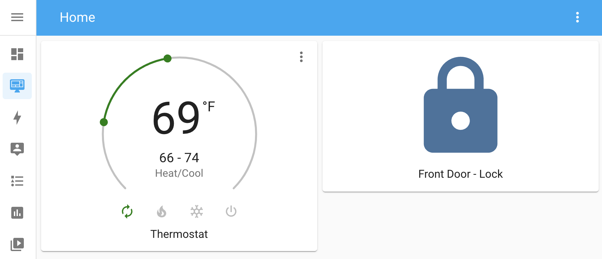

# SmartRent Home Assistant Component

[![GitHub Release][releases-shield]][releases]
[![HACS Shield][hacs-shield]](https://github.com/hacs/integration)
[![GitHub][license-shield]](LICENSE.txt)
[![Code style: black][black-shield]](https://github.com/psf/black)
[![Downloads][downloads-shield]](https://github.com/ZacheryThomas/homeassistant-smartrent/releases)


This is a basic Homeassistant component to support SmartRent Locks and Thermostats. This component uses the `smartrent.py` library that can be found [here](https://github.com/ZacheryThomas/smartrent.py)!



## Installation

You can either install this integration as an HACS custom component or install it mannually
### Installing with HACS
* Select HACS Icon in left menu bar
* Select `Integrations`
* Click on `Explore & Download Repositories`
* Search for `SmartRent` and open the result that is returned
* You can then download the repo by clicking `Download this repository with HACS`
* You will then have to restart your Home Assistant instance
* After that, you can add the Integration as usual by going to `Configuraton > Devices & Services > Add Integration`


### Installing manually

#### Moving custom component to right directory
```
# How your HA config directory should look

config
└── ...
└── configuration.yaml
└── secrets.yaml
└── custom_components
    └── smartrent
        └── climate.py
        └── lock.py
        └── manifest.json
        └── ...
```

You have to move all content in the `custom_components/smartrent` directory to the same location in Home Assistant. If a `custom_components` directory does not already exist in your Home Assistant instance, you will have to make one. You can learn more [here](https://developers.home-assistant.io/docs/creating_integration_file_structure#where-home-assistant-looks-for-integrations).

After all of those are in place, you can restart your Home Assistant server and the component should load.

#### Start the integration
You should be able to now load the integration. This can be done by going to `Configuraton > Devices & Services > Add Integration`

You should be able to search for SmartRent and then enter your email and password in the popup.

[license-shield]: https://img.shields.io/github/license/zacherythomas/homeassistant-smartrent.svg?style=for-the-badge
[hacs-shield]: https://img.shields.io/badge/HACS-Default-41BDF5.svg?style=for-the-badge
[black-shield]: https://img.shields.io/badge/code%20style-black-000000.svg?style=for-the-badge

[releases-shield]: https://img.shields.io/github/release/zacherythomas/homeassistant-smartrent.svg?style=for-the-badge
[releases]: https://github.com/zacherythomas/homeassistant-smartrent/releases
[commits-shield]: https://img.shields.io/github/commit-activity/y/zacherythomas/homeassistant-smartrent.svg?style=for-the-badge
[commits]: https://github.com/zacherythomas/homeassistant-smartrent/commits/master
[downloads-shield]: https://img.shields.io/github/downloads/zacherythomas/homeassistant-smartrent/total?style=for-the-badge